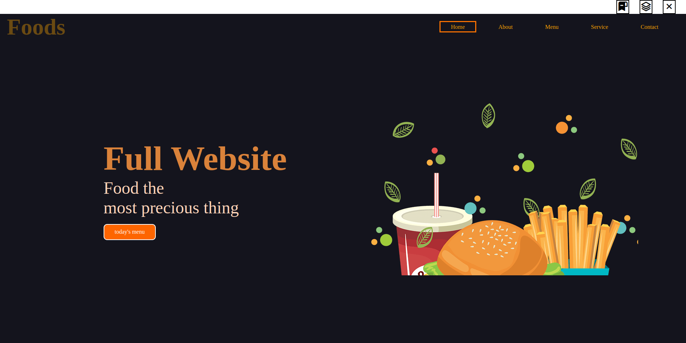
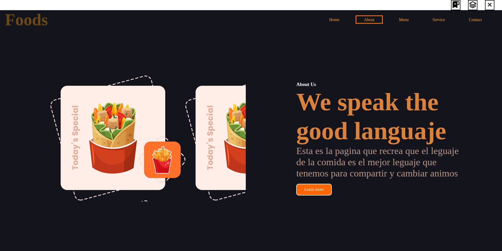
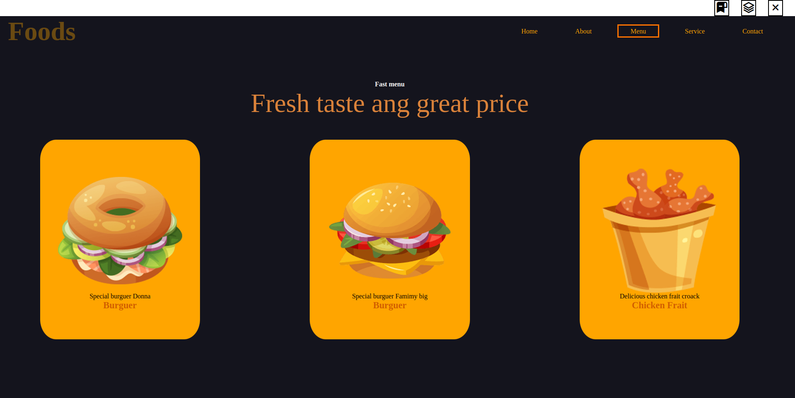
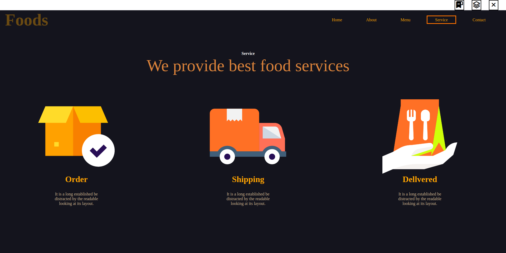

## LEER
Esta es una pagina de comidas rapidas creada con el animo de que todos puedan tener una breve intro
de la pagina y lo que desean comer.
## QUE HACE?? 
Esta pagina cuenta con un navbar que contiene Home Services About Contact Menu cada una de estos creados para 
tener una mayor organizacion de todos los elementos.
## Home

Esta es la pagina de inicio den de la experiencia comienza con breve intro de un alimento y como se puede ver el navbar
tiene un mensaje alentador para aquellas personas amantes a la comida puedan sentirce identificada con el mensaje y tenga un mayor probailidad
de que pidan algo o entren para ver su contenido.
## About

Esta es la parte de About Donde al igual que el home tiene mensajes pero este tiene contenido interactivo para que 
la persona se sienten aun mas atraida a esta pagina tiene Text shadow en lagunas de las letras, esto estimula a las personas con pequeños
detalles que hacen dse pagina mas divertida.
## Menu

Esta parte es la de eleccion del menu donde los cuadros son interactivos para que sean atractivos, esto solo es un breve resumen de la carta que tiene mas cosas
pero este es como el mas usado y el mas pedido para facilitar a aquellas personas que quieran pedir algo para comer super facil. y tambien para aquellas personas que quieren tener facil
acceso a su comida favorita
## Service

esta es la parte para despèjar algunas dudas reclamos de las personas quierqan hacer, este aoartado no tiene diseños interactivos con el proposito de ser la parte mas seria de la pàgina 
y en donde cada pèrsona que tenga una duda sobre su pedido o aalgun reclamo puede hacerse e incluso pedir algunos detales como quiere lo que pide
## Contact

esta es la parte donde tienes mayor contacto con el servicio al cliente y todo aquello de dudas a las personas pero aun mas serias, esta parte tampòco tiene interaciones
ya que tiene el proposito de ser mas serias.